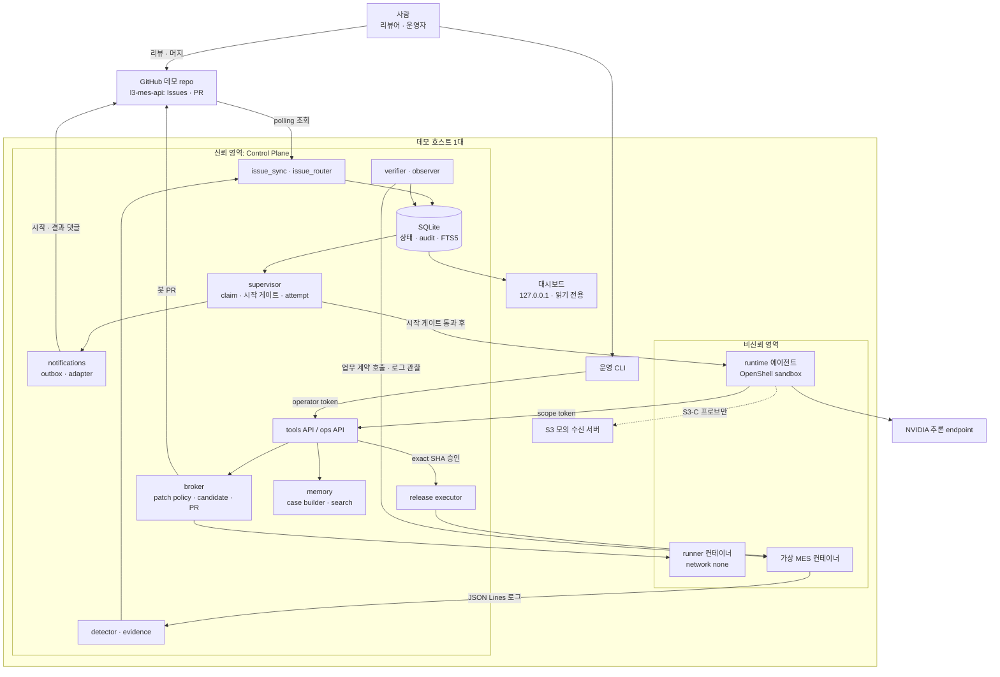
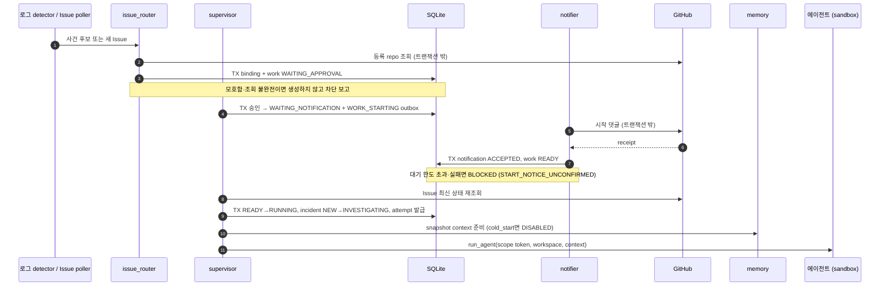
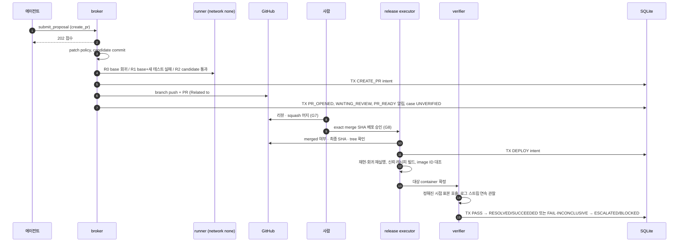
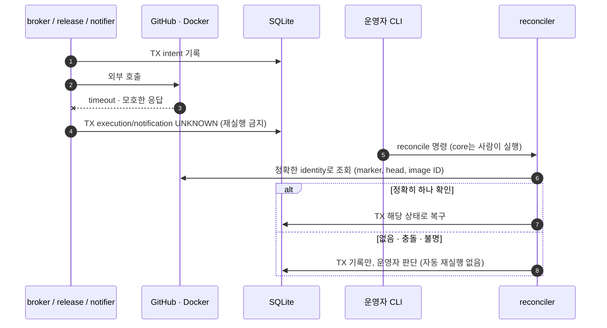

# ARCHITECTURE — LineMedic v4 아키텍처 개요

> **문서 지위**: 시스템 구조를 한 파일로 읽기 위한 개요이며 정본이 아니다. 정본은 [spec 02](spec/docs/02-architecture.md)(배치·책임), [spec 06](spec/docs/06-broker-runner.md)(브로커·러너), [spec 07](spec/docs/07-security.md)(보안), [spec 08](spec/docs/08-release-verification.md)(릴리스·검증)이다. 충돌하면 spec → [DECISIONS.md](DECISIONS.md) → 이 문서 순으로 따른다([AGENTS §8](AGENTS.md)).
> **현재 상태**: 코드 없음. 아래 모듈·경로·프로세스는 **구현 목표**다.
> 관련 개요: [PRD.md](PRD.md)(무엇을·왜) · [SPEC.md](SPEC.md)(계약) · [ADR.md](ADR.md)(결정 색인)

## 1. 설계 원칙

| 원칙 | 뜻 | 근거 |
|---|---|---|
| 단일 호스트, 단일 활성 run, 단일 에이전트 | 모든 평가는 확정한 데모 호스트 1대에서 한다. 동시 RUNNING work는 1개 | [D23](ADR.md), FR-16 |
| 서비스가 아니라 모듈 | detector·router·supervisor·notifier·memory builder는 같은 Control Plane 프로세스의 Python 모듈이다 | [spec 02 §1](spec/docs/02-architecture.md) |
| 신뢰/비신뢰 분리 | 에이전트, 생성 코드, 그 코드를 실행하는 runner·MES는 비신뢰 영역이다 | [D09](ADR.md), INV-04 |
| intent → 외부 호출 → 결과 기록 | 외부 호출(GitHub·모델·SMTP·Docker)은 DB 트랜잭션 밖에서 한다. 불명이면 `UNKNOWN`, 재조회만 | [D11](ADR.md), INV-06 |
| 판정 권한의 집중 | `RESOLVED`는 verifier만, 배포는 사람 승인만, 외부 쓰기는 Control Plane만 | INV-01·02, [D12](ADR.md) |
| 외부 연동은 port 뒤에 | GitHub·Docker·에이전트 runtime·시계를 교체 가능한 인터페이스로 두고 테스트는 fake를 쓴다 | [D46·D47·D51·D53](ADR.md) |
| 만들지 않는 인프라 | 공개 webhook listener, 메시지 브로커·event bus, vector DB, 멀티 에이전트 스케줄러, 범용 컨테이너 API | [docs/06 §2](docs/06-invariants.md) |

## 2. 시스템 컨텍스트

[spec 02 §1](spec/docs/02-architecture.md)의 배치도를 개요 수준으로 다시 그린 것이다. 화살표는 데이터·제어 흐름이며, 모두 네트워크 호출이라는 뜻은 아니다.



## 3. 컴포넌트

패키지 경로는 [docs/02 §2](docs/02-repo-layout.md) 기준이다. 모듈의 입력·출력·"소유하지 않는 것"은 [spec 02 §2](spec/docs/02-architecture.md)를 따른다.

| 컴포넌트 | 경로 (`linemedic/…`) | 책임 | 소유하지 않는 것 | 카드 |
|---|---|---|---|---|
| store · state · audit | `control_plane/store.py`, `state.py`, `audit.py`, `migrations/` | 트랜잭션·CAS·전이 표·감사 원본 | 외부 호출 | W06 |
| auth · API | `control_plane/auth.py`, `app.py`, `tools_api.py`, `ops_api.py`, `idempotency.py` | principal·scope, 9개 도구, 운영 API, 멱등성 | 임의 exec·URL, force-resolve | W06~W09 |
| detector · evidence | `control_plane/detector.py`, `evidence.py` | 로그 → signature → fingerprint → incident, 증거 정제 | Issue 자연어 동일성 확정 | W07 |
| Issue intake | `control_plane/issue_sync.py`, `issue_router.py`, `catalog.py` | polling·mirror·checkpoint, 매칭·생성·binding | 모델 조사·패치 | W22~W24 |
| supervisor | `control_plane/supervisor.py` | work claim·승인·재시도·취소, 시작 게이트, attempt 발급 | 임의 운영 변경·자동 머지 | W25, W26, W28 |
| notifications | `control_plane/notifications/` | outbox, 이벤트 7종 템플릿, `github_comment` adapter(SMTP는 G12 선택 시) | 작업 성공 판정·수신자 선택 | W26 |
| broker | `control_plane/broker/` | 제안 접수·B01~B06 검사, patch policy, candidate, R0/R1/R2, PR, 정비 초안, execution reconcile | Issue closed를 복구로 번역 | W09~W11 |
| release | `control_plane/release.py` | 사람이 승인한 exact SHA의 재검사·빌드·기동 | 자동 머지·자동 rollback | W12 |
| verifier · observer | `control_plane/verifier.py`, `observer.py`, `contracts/` | 업무 계약 판정, 로그 스트림·identity 불변 관찰 | 앱의 자기보고 신뢰 | W05 |
| memory | `control_plane/memory/` | case note 생성·revision, snapshot manifest, 검색, history projection | 자기보고 성공 승격·재학습 | W27 |
| agent 쪽 | `agent/` | `AgentAdapter`, tools client, 선택한 runtime 하나, prompt·skill, trace | 직접 GitHub·메일 쓰기·상태 변경 | W13, W14 |
| runner | `runner/` | 고정 runner·MES 빌드 레시피, 보호된 pytest profile | 네트워크·host secret | W04, W10 |
| factory_sim | `factory_sim/` | 합성 fixture·시나리오 주입·카메라 지표·S1b harness·S3 sink | 제품 경로 우회 | W04, W05, W08, W17 |
| eval | `eval/` | 기대값·holdout·평가 harness·snapshot. **에이전트 비노출** | runtime 입력 | W20, W27 |
| dashboard · CLI | `dashboard/`, `cli.py` | 읽기 전용 화면, 운영 명령 | 쓰기 route, token 저장 | W18, 카드별 |
| 공통 | `common/`, `integrations/` | Clock·ID·canonical JSON·config·정제, GitHubPort·DockerPort | — | B00, W05, W22 |

## 4. 신뢰 경계와 권한

정본: [spec 07 §1·§2](spec/docs/07-security.md), [spec 02 §4](spec/docs/02-architecture.md).

| 주체 | 허용 | 금지 |
|---|---|---|
| runtime 에이전트 | 자기 code copy, 자기 사건의 `/tools/*`, 승인된 추론 경로 | `/ops/*`, 제어 DB, GitHub, SMTP, Docker socket, 평가 기대값, OT |
| runner | 해당 단계의 읽기 전용 코드·테스트, 크기 제한 `/tmp` | 네트워크, control credential, Docker socket, host home |
| candidate MES | 합성 fixture 읽기, 자기 로그 | Control API, GitHub, 모델 API, OT, host secret |
| Control API | principal scope의 증거·제안 처리 | 비신뢰 command·URL을 host에서 실행 |
| broker · release | 등록 repo PR, catalog에 있는 고정 runner·image 조작 | 임의 repo·경로·이미지·container 명령 |
| verifier | 정해진 MES HTTP 경로, host 관찰 metadata | 에이전트가 편집한 계약, 임의 URL, 임의 복구 |
| notifier | 선택한 고정 route의 쓰기 | 사용자 입력 주소, 임의 외부 전송 |
| operator | 승인·초기화·reconcile | 검증 없는 RESOLVED 강제 |

GitHub 자격 증명은 두 개로 나눈다(D46). 봇(broker) credential은 데모 repo의 Issue·PR만 쓰고, setup credential은 `baseline/*` 브랜치 생성에만 쓴다. 봇으로 보호 규칙을 바꾸지 않는다. 격리는 "단일 호스트가 침해되지 않는다"는 가정 아래의 설계이며 보안 인증이 아니다([spec 02 §7](spec/docs/02-architecture.md)).

## 5. 런타임 뷰

### 5.1 입력 → work → 시작 게이트 → attempt

두 입구는 에이전트를 따로 호출하지 않고 같은 경로로 들어온다. writable workspace는 시작 알림 receipt 뒤에만 생긴다(INV-12).



### 5.2 S1 코드 경로: 제안 → PR → 사람 → 릴리스 → 검증



S2-lite는 5.2의 브로커 단계에서 `create_work_order_draft`로 갈라져 로컬 초안만 만들고(`HANDED_OFF`), `escalate`는 차단 보고로 끝난다.

### 5.3 결과 불명(UNKNOWN) 조정



자동 bounded 재조회는 hardening H04다.

## 6. 데이터 뷰

| 요소 | 설계 |
|---|---|
| 저장소 | stdlib `sqlite3`, WAL, `BEGIN IMMEDIATE`, `busy_timeout`, ORM 없음(D45) |
| 동시성 | 모든 상태 변경은 version CAS. unique 제약으로 Issue당 활성 work 1개, 전역 RUNNING 1개 |
| 감사 | `audit_events`가 원본, JSONL은 export 산출물(D17) |
| 외부 부작용 | `executions`(Issue·PR·초안·배포)와 `notifications`(outbox)에 서버가 만든 논리 키 unique |
| 사례 기억 | `case_notes`(revision·outcome·origin) → `case_search`(FTS5 파생 인덱스, 재구축 가능). FTS5가 없으면 `keyword_fallback`(D54) |
| 평가 격리 | `routing_scope=eval:<run_id>`, run별 `baseline/<run_id>` 브랜치, memory snapshot은 불변 manifest |
| 파일 | run별 manifest·원본 증거·workspace는 `RUNS_DIR`(git 제외), 실제 확인 기록은 `evidence/` |

DDL 원문은 [spec 04 §5](spec/docs/04-data-state.md), 테이블 역할 요약은 [SPEC.md §4](SPEC.md)에 있다.

## 7. 외부 연동 port

외부 의존은 인터페이스 뒤에 두고, 게이트가 열리기 전에는 fake로 대부분의 카드를 진행한다.

| port | 실제 구현 | 테스트 구현 | 결정 |
|---|---|---|---|
| `GitHubPort` | `httpx` 동기 REST 호출 | `FakeGitHub`(메모리) | D46 |
| `DockerPort` | `docker` CLI를 argv 리스트로 호출(`shell=False`, timeout) | `FakeDocker` | D47 |
| `AgentAdapter` | 선택한 runtime 하나(OpenClaw/NemoClaw 또는 NAT, G4 후) | `ScriptedAdapter`(origin=`manual_integration`) | D53 |
| `Clock` | UTC now·monotonic·sleep | `FakeClock` | D51 |
| 알림 adapter | `github_comment`(SMTP는 G12 선택 시 교체) | fake adapter | [spec 16 §1](spec/docs/16-notifications.md) |

## 8. 배치 뷰 (데모 호스트)

| 프로세스·컨테이너 | 역할 | 격리 |
|---|---|---|
| Control Plane (`make start`) | FastAPI API + supervisor·poller·outbox·broker 루프 | 신뢰. API는 에이전트/운영자 권한 분리 |
| 대시보드 (`python -m linemedic.dashboard`) | 상태 화면 | `127.0.0.1` bind, SQLite 읽기 전용(D49) |
| 운영 CLI (`python -m linemedic.cli`) | 승인·reconcile·run 관리 | operator token으로 HTTP 호출, demo 전용 명령은 host 함수 직접 호출(D48) |
| OpenShell sandbox | runtime 에이전트 | 정책 hash·sandbox identity 기록. 정책 schema는 G5 확인 전 미정 |
| runner 컨테이너 | R0/R1/R2 테스트 실행 | network none, non-root, read-only root, 자원 상한([spec 06 §5](spec/docs/06-broker-runner.md)) |
| MES 컨테이너 | 패치가 적용되는 가상 서비스 | 신뢰 레시피로 빌드, Control API·GitHub·모델 접근 없음 |
| S3 모의 수신 서버 | S3-C 대조 프로브 대상 | 팀 소유, 시험 전용 |

모든 run은 호스트 manifest(OS·arch·Docker·runtime·OpenShell 버전)와 연결한다(FR-16). 호스트는 G1에서 정한다.

## 9. 저장소 구조

```text
lineMedic/
├── PRD.md SPEC.md ARCHITECTURE.md ADR.md   # 개요 (이 문서들)
├── AGENTS.md CLAUDE.md README.md STATUS.md DECISIONS.md  # 진행 상태·완료 보고는 STATUS.md 직접 편집
├── spec/ docs/ tasks/                      # 정본·통합 참조·작업 카드
├── linemedic/                              # Control Plane + agent + runner + eval (B00부터)
├── l3-mes-api-seed/                        # 데모 대상 repo 시드. 정답 패치·기대값 없음 (W04)
├── config/linemedic.toml                   # 비밀 아닌 catalog (D52·D60)
└── evidence/                               # 실제 스파이크·live 실행 기록
```

원격 `l3-mes-api`의 git 이력은 `scripts/seed_demo_repo.py`가 시드에서 만든다(D42). 에이전트 workspace에는 이 repo의 고정 base 사본만 들어가고 LineMedic 저장소·token·verifier·평가 자료는 들어가지 않는다([docs/02 §5](docs/02-repo-layout.md)).

## 10. 품질 속성과 트레이드오프

| 속성 | 선택 | 대가 | 결정 |
|---|---|---|---|
| 정확성(중복 방지) | DB unique + CAS + 서버 논리 키 | 단일 프로세스여도 트랜잭션 설계가 필요 | D11, D35 |
| 안전성 | 시작 알림 게이트, 사람 머지·배포 승인, verifier 전용 판정 | 알림 공급자 장애 시 작업이 지연됨 | D03, D12, D33 |
| 정직한 결과 | outcome을 verifier·phase·origin으로 분리, 알림과 복구 판정 분리 | 성공 건수가 적게 보일 수 있음 | D36, D39 |
| 단순성 | polling, SQLite FTS5, 모듈형 단일 프로세스 | 실시간 감지·의미 검색 없음 | D31, D37 |
| 재현성 | run별 baseline 브랜치, exact SHA·image identity chain, config hash | 매 run 사람 개입(G7·G8) 필요 | D04, D05, D52 |
| 테스트 용이성 | port + fake, 주입 가능한 Clock | 실제 연동은 live 테스트로 따로 증명해야 함 | D46, D51, D55 |

## 11. 미정 사항

| 항목 | 확정 조건 | 확정 전 처리 |
|---|---|---|
| 데모 호스트 OS·arch | G1 | 로컬 개발만. 평가 run 없음 |
| NVIDIA 모델 ID·endpoint | G3, 스파이크 N01 | 후보명만. 코드에 고정하지 않음 |
| agent runtime | G4, 스파이크 N01·N02 | `ScriptedAdapter`까지만 |
| OpenShell 정책 schema·버전 | G5, 스파이크 N03·N04·N09 | 미확인 정책을 실행 설정으로 쓰지 않음 |
| GitHub API 버전 헤더 | 스파이크 N11 (G2 후) | config 키만 |
| 알림 채널 SMTP 여부 | G12 | `github_comment` 1개 |
| NeMo Guardrails | G6 (R2 답변) | 사용하지 않음 |

게이트 절차는 [docs/10](docs/10-human-gates.md), 게이트 대기 결정은 [ADR.md §4](ADR.md)에 있다.
