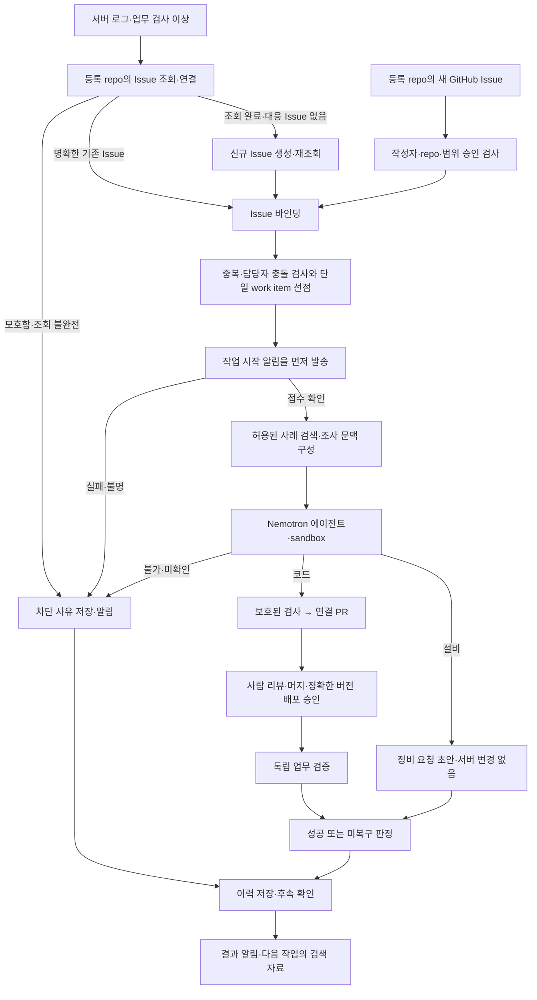

# LineMedic v4 — Issue 중심 장애 대응과 검증 기반 사례 재사용

> **수정 설계안 / 제품 구현·실행 결과 아님.** 입력은 사용자가 보강한 v3의 Markdown 18개와 이번 추가 요구사항이다. v3의 공장 IT·설비 분기, 사람 승인, exact SHA 배포, 독립 검증, 실제 sandbox 실행 목표를 유지한다. 새 요구가 추가됐다고 남은 개발 시간이 늘어나지는 않는다.

## 1. 제품 정의

**서버 로그 또는 등록된 GitHub Issue를 받아, 같은 작업을 중복 생성하지 않고 담당 Issue에 연결한다. 작업 시작을 먼저 알린 뒤 코드 수정 또는 설비 점검 요청을 수행하고, 처리 결과·실패 원인을 검증 수준과 함께 저장해 다음 조사에 재사용하는 공장 IT 에이전트다.**

예선은 가상 3라인(L3), 합성 MES 로그·카메라 지표, 팀 소유 데모 저장소 하나다. 실제 공장·고객 데이터, 실제 정비 지시, PLC 제어는 범위 밖이다. ‘대응 이력 재사용’은 모델 재학습이 아니라 **검색한 사례를 근거로 읽고 현재 상황에서 다시 검증하는 것**이다.

## 2. 이번 사용자 요구와 v4 결정

| 요구 | v3 확인 | v4 최소 구현 |
|---|---|---|
| 로그와 같은 GitHub Issue가 없으면 생성 후 작업 | Issue 연동은 P1, 내부 incident와 PR이 중심 | 등록 repo에서 조회 → 확정 연결 또는 신규 Issue 생성 → 작업 생성 |
| 기존 Issue가 있으면 그 Issue에서 작업 | 동일 PR의 재사용만 정의 | Issue binding과 작업 단위 연결, 다른 작업자·PR과 충돌 시 이관 |
| 새 Issue 감시, 작업 전에 알림 | 입력 경로·시작 알림 계약 없음 | 권한이 확인된 새 Issue를 polling으로 접수 → 시작 댓글 접수 확인 → 실행 |
| 할 수 없는 작업은 이유 정리·알림 | `escalate`와 로컬 기록은 있음, 발송은 없음 | 구조화된 차단 보고서 + 실제 알림 채널 1개 + 실패 outbox |
| 오류·개선·결과를 저장해 정답·오답노트로 사용 | 원본 실행 저장은 있음, 지식은 정적 매뉴얼 | 검증 수준별 case note + exact/FTS 검색 + 인용과 현재 상태 재검증 |

세부 원문 위치와 변경 이유는 [v3 검토 보고서](V3-REVIEW-AND-V4-CHANGES.md)에 있다. 표의 ‘없음’은 v3 문서 계약의 부재이며 실제 코드 부재를 확인한 말이 아니다.

## 3. 전체 workflow

이 그림은 Control Plane의 책임과 기록 흐름이다. 에이전트의 조사 순서나 사고과정을 고정하지 않는다. 로그에서 원인 조사를 위한 **읽기 전용 수집**은 Issue 연결 전에도 가능하지만, writable 작업 공간을 주고 패치를 작성시키는 단계는 시작 알림 확인 이후다.

## 4. 유지하는 세 장면과 새 운영 장면

| 장면 | 도착점 | 성공으로 오해하면 안 되는 것 |
|---|---|---|
| S1 코드 오류 | Issue → 시작 알림 → 실제 agent 패치 → PR → 사람 승인 → 업무 검증 | PR 생성·머지·test PASS만으로 복구 아님 |
| S2-lite 설비 점검 | 같은 Issue에 정비 요청 초안·담당자 확인사항 | 점검 요청 발송과 실제 설비 복구는 다름 |
| S1b 거짓 정상 | HTTP 200의 틀린 집계 거절 | 사람이 주입한 결함을 agent 성공률에 포함하지 않음 |
| S3 안전성 | agent 반응·broker 거절·sandbox 프로브를 분리 기록 | 연결 실패 전체가 정책 차단인 것은 아님 |
| S4 Issue 연결 | 신규 생성, 기존 재사용, 모호함·누락 안전 정지 | 비슷한 제목만으로 같은 원인 확정 불가 |
| S5 Issue 입력 | 승인된 새 Issue를 작업으로 접수, 시작 알림보다 빠른 수정 0건 | 전체 공개 Issue를 무조건 실행하지 않음 |
| S6 불가 보고 | 이유·근거·해본 일·필요 조치가 있는 외부 알림 | 로컬 이벤트 저장만으로 발송 완료 아님 |
| S7 사례 재사용 | 검증된 성공·실패 사례를 찾아 현재 판단에 인용 | 과거 정답이 현재에도 맞는다는 보장은 아님 |

S4~S7을 각각 새 서비스로 만들지 않는다. 기존 S1·S2에 입구와 결과 처리를 붙이고, 제어부 회귀 시험으로 중복·실패 경계를 검증한다.

## 5. core / hardening / 확장 범위

### core-v4: 이번 요청을 충족하는 가장 작은 구현

한 repo·한 서비스 매핑·동시 에이전트 1개, **Issue polling 60초 초기값**, GitHub Issue 댓글을 기본 알림 채널로 사용한다. 수신자의 GitHub 알림 설정에 따라 실제 이메일·앱 통지는 달라지므로, 댓글 API 접수와 사람의 수신·열람은 구분한다. 이메일이 필수인 데모라면 같은 계약의 SMTP 어댑터 **하나로 선택 변경**하고 실제 시험한다.

저장소는 기존 FastAPI + SQLite를 유지한다. 사례 검색은 안정된 문제 fingerprint의 exact 조회와 SQLite FTS5의 키워드 검색으로 시작한다. 결과를 모델에 전달·인용하면 lexical RAG 경로이며 임베딩 검색으로 부르지 않는다.

v3의 H01(중복 claim 경합), H02(같은 멱등키·다른 본문 409)는 **core로 승격**한다. 로그와 Issue라는 두 입력이 동일 작업을 깨울 수 있어 필수 correctness 조건이 됐기 때문이다. 작업 시작 알림을 확인하기 전 수정 금지, 결과 불명 시 재조회, 사례 결과의 신뢰 수준 구분도 core다.

### hardening

자동 bounded reconcile, 풍부한 collector heartbeat 진단, 상세 화면, 추가 보안·장애 조합 시험. 다만 **로그 관찰 가능성을 확인하지 못하면 검증을 PASS로 만들지 않는 것**은 계속 core다.

### 확장(P1)

공개 HTTPS webhook 수신, 다중 저장소, 여러 알림 채널 동시 발송, 임베딩·벡터 DB·reranker, 자동 정비 완료 수집, CMMS, 자동 재조사·머지 감시, 온프레미스 NIM. webhook을 구현하지 않아도 polling으로 ‘Issue 감시’의 기능을 제공할 수 있으나 실시간이라고 표현하지 않는다.

### 계속 금지

자동 머지·사람 승인 없는 배포, 모델이 지정한 임의 수신자·웹훅 URL, 기존 타인의 작업 강탈, 실제 PLC 접속·제어, 회사·고객 데이터, 보호 테스트 수정, 무한 repair loop, 기존 Harness Toolkit 재설계.

## 6. 상태와 권한의 네 가지 분리

**GitHub Issue**는 협업 티켓, **incident**는 관찰된 장애, **work item/attempt**는 수행 단위, **case note**는 과거 결과 기록이다. Issue가 닫혔다고 incident가 `RESOLVED`가 되지 않는다. 테스트만 통과한 PR은 정답노트로 승격하지 않는다. 알림 발송 실패가 이미 확인된 업무 복구를 취소하지도 않는다.

에이전트 액션은 `create_pr`, `create_work_order_draft`, `escalate` 세 개를 유지한다. Issue 검색·생성, 선점, 알림, 결과 기록은 **Control Plane의 라이프사이클 기능**으로 넣는다. 모델에 GitHub나 이메일 관리 토큰을 주지 않는다.

## 7. 검증 주장의 한계

| 관찰 | 보장 범위 | 보장하지 않는 것 |
|---|---|---|
| Issue binding·완료된 조회 | 등록 scope에서 해당 티켓에 연결한 근거 | 모든 자연어 Issue에 대한 완벽한 중복 탐지 |
| 시작 알림 receipt | 수정 전에 공급자가 알림 요청을 접수 | 사람이 읽었음, SMTP 최종 inbox 배달 |
| 재현 실패→패치 통과 | 코드 변경에 반응하는 테스트 | 코드가 실제 유일한 원인임 |
| 업무 verifier PASS | 특정 image·contract·관찰 구간 통과 | 전체 운영 안정성·안전 인증 |
| 성공·실패 사례 검색 | 과거에 기록·검증된 조건과 결과 제공 | 자동 학습, 새 장애의 자동 정답 |

## 8. 일정과 통과선

v3의 9/27~9/28 KST 일정은 **팀이 작성한 기존 계획**으로 보존한다. v4 착수 시 이미 끝난 W 작업과 남은 팀 시간을 먼저 확인한다. 48시간을 다시 처음부터 계산하지 않는다. 상세 순서·선행 관계·절대 시각 재기입란은 [10](docs/10-delivery-plan.md)에 있다.

수정 순서는 **기존 verifier 보존 → Issue 연결·단일 선점 → 시작 댓글 → 실제 agent 기존 경로 → 차단·결과 알림 → 사례 저장·검색 → 반복 평가**다. 기능 조합만으로 완주 확률을 부여하지 않는다.

v4 완료 주장에는 S1/S2-lite/S1b/S3에 더해 S4~S7의 실제 확인이 필요하다. 시간이 모자라면 구현한 경로와 미구현 항목을 분리한다. v3 core만 돌아가면 ‘Issue 자동화와 사례 재사용은 설계’라고 적는다. 전체 자동복구라고 과장하지 않는다.

## 9. 읽을 문서와 중단선

작업 전체 흐름은 [15 Issue 입력](docs/15-issue-intake-workflow.md), [16 알림](docs/16-notifications.md), [17 사례 기억](docs/17-case-memory.md)이 기준이다. API는 [03](docs/03-api-contracts.md), DDL·상태는 [04](docs/04-data-state.md)로 연결한다. v3와의 차이는 [검토 보고서](V3-REVIEW-AND-V4-CHANGES.md), 전환 절차는 [18](docs/18-migration-validation.md)을 본다.

core-v4의 실제 실행과 평가 증거가 확보되면 새 기능을 멈춘다. 벡터 DB·추가 에이전트·다채널 플랫폼을 넣는 대신, **같은 Issue에서 일하고 시작을 알리며, 못 한 이유와 검증된 결과를 남기는 흐름**을 끝낸다.
