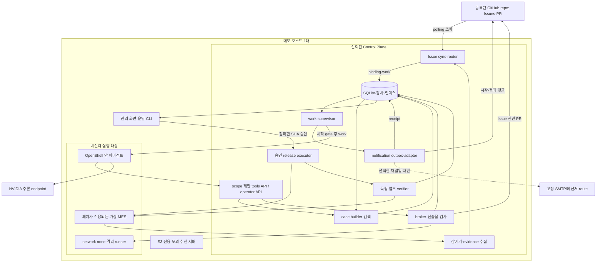

# 02. 시스템 아키텍처와 책임 경계

> v4 설계. 기존 단일 호스트·FastAPI + SQLite·보호된 runner·OpenShell 구성을 유지한다. Issue 입력, 알림, 사례 기억은 같은 Control Plane의 모듈이며 새 마이크로서비스 플랫폼이 아니다.

## 1. 배치



모든 화살표를 네트워크 서비스로 구현하지 않는다. DB, router, supervisor, notifier, memory builder는 Python 모듈이다. 공개 webhook listener·메시지 브로커·vector DB·멀티 agent scheduler는 core에 없다. API listener는 에이전트와 운영자 권한을 분리한다.

## 2. 모듈별 책임

| 모듈 | 입력 | 출력 | 소유하지 않는 것 |
|---|---|---|---|
| detector | 실제 합성 서비스 로그·검사 이상 | 안정된 signature·정제 증거 | Issue 자연어 동일성 확정 |
| issue_sync/router | 등록 repo 목록·로그 후보 | Issue mirror·binding·work | 모델의 조사·패치 생성 |
| supervisor | 승인된 work·start receipt | 단일 attempt·예산·sandbox 작업 | 임의 운영 변경·GitHub 자동 머지 |
| notifier | durable outbox | provider receipt/실패/UNKNOWN | 작업 성공 판정·수신자 자유 선택 |
| agent | Issue·증거·허용 history·현재 코드 | 한 개의 제안 | 직접 GitHub/메일 쓰기·상태 변경 |
| broker/runner | 제안과 고정 source | 검증된 PR 또는 초안/차단 결과 | Issue closed를 복구로 번역 |
| release/verifier | 사람 승인한 SHA·업무 계약 | exact image 배포·PASS/FAIL/INCONCLUSIVE | 자동 머지·새로운 repair loop |
| case builder/retriever | 기록된 관찰·검사·사유 | 검증 수준별 사례·조회 근거 | 자기보고 성공 승격·재학습 |
| UI/CLI | 저장된 상태 | 승인·정확한 현황·재조회 요청 | 임의 force-resolve |

## 3. 입구에서 실행까지

로그 입구는 읽기 전용 수집으로 시작한다. 새/기존 Issue를 정하고 확인한 뒤 작업을 만든다. Issue 입구는 repo·작성자·생성시각·처리 정책을 확인한 뒤 동일한 작업 생성 경로로 들어온다. **두 입구가 직접 agent를 따로 호출하지 않는다.**

```text
router.ensure_issue_and_work()
  → supervisor.claim_work()                  # SQLite short transaction
  → notifier.enqueue(WORK_STARTING)
  → provider accept + receipt persist
  → supervisor.recheck_scope_and_open_state()
  → memory.prepare_snapshot_context()
  → adapter.start(attempt)                    # writable workspace 시작
```

메모리 서비스가 일시 실패했을 때는 `history_status=UNAVAILABLE`를 표시한다. 현재 근거만으로 진행하는 허용 fallback인지, 해당 데모가 memory 증명을 요구해 중단할 것인지는 run policy에 고정한다. 실패를 no-hit로 숨기지 않는다. cold_start는 의도적으로 사례를 제외한다.

## 4. 외부 권한

| 실행 주체 | 보유 권한 | 차단해야 할 경로 |
|---|---|---|
| GitHub adapter | 데모 repo의 metadata·Issues·PR·필요 contents만 | 다른 repo·관리 권한·branch 보호 변경 |
| notifier | 선택한 고정 route의 쓰기 권한 | 사용자 입력 주소·임의 외부 전송 |
| agent | 사건/작업 범위 tools token, 선택 추론 경로 | GitHub·SMTP·operator token·Docker socket |
| runner | 고정 source와 쓰기 제한 scratch | 네트워크·host secret·Control Plane |
| patched MES | 데모 서비스 최소 통신 | Control Plane 관리 API·GitHub·SMTP·OT |
| 운영자 | 승인·중단·mapping·reconcile | 검증 결과 없는 RESOLVED 강제 작성 |

GitHub App 또는 봇 계정으로 PR을 만들고 다른 사람이 리뷰한다. `baseline/*` 보호·squash 단일 머지 설정은 v3에서 유지한다. Issue/댓글 연동에 필요한 Issues 권한은 W22에서 실제 확인한다. bot token으로 보호 규칙 자체를 바꾸지 않는다.

## 5. GitHub와 평가 격리

PR 대상은 별도 `l3-mes-api` 데모 repo다. run마다 `baseline/<run_id>`와 `autofix/<run_id>/<incident_id>/<proposal_id>`를 사용한다. main을 반복 초기화하지 않는다. 배포는 해당 PR의 승인된 최종 SHA를 사용한다.

Issues는 branch별 리소스가 아니므로 branch 격리만으로 부족하다. 내부 `routing_scope=eval:<run_id>`와 bot marker에 run/scope를 기록하고, 평가 입력만 해당 scope에 넣는다. 다른 run의 Issue를 재사용할지는 memory-assisted 시나리오가 명시적으로 정한다. 실제 상시 운용 scope는 `live`다.

공식 API에 없는 scope 필드를 GitHub가 강제한다고 가정하지 않는다. scope는 Control Plane의 정책·DB·시험 규칙이다. Issue 목록 전체를 읽고도 자동 작업 대상은 승인된 입력으로 제한한다.

## 6. 구현 목표 저장소 구조

```text
linemedic/
  control_plane/
    app.py
    store.py
    detector.py
    issue_sync.py          # polling·mirror·checkpoint
    issue_router.py        # match·create·binding
    supervisor.py          # work claim·start gate·attempt
    broker/                # 기존 policy·runner·PR·draft
    notifications/         # outbox + 선택한 adapter 하나
    memory/                # case builder·lexical retrieval
    release.py
    verifier.py
    audit.py
  agent/                   # 선택한 runtime·scope tools·skills
  policies/                # repo/actor/route catalog·sandbox·broker
  contracts/               # 보호된 업무 계약·API schema
  runner/                  # 고정 이미지, 비신뢰 테스트 실행
  factory_sim/             # MES·카메라 지표·S3 sinks
  eval/                    # 기대값·snapshot manifest, agent 비노출
  tests/                   # 상태·Issue·알림·memory 회귀
  scripts/                 # 등록·승인·reconcile·reset·evaluate
  dashboard/               # 한 화면
```

## 7. 운영 전제와 제한

한 호스트·한 활성 demo run·한 agent를 유지한다. 단일 프로세스여도 polling·HTTP·알림 처리가 겹치므로 DB unique와 CAS는 core다. 단일 호스트가 침해되지 않는다는 가정 아래의 격리이며 운영 보안 인증이 아니다.

v3가 정한 동일 호스트 평가와 host manifest는 유지한다. 팀의 실제 OS/arch/OpenShell 지원, NVIDIA endpoint, GitHub 접근, 알림 채널은 환경 스파이크로 확인한다. 도구 이름만 보고 지원 플랫폼·정책 기능을 단정하지 않는다.
